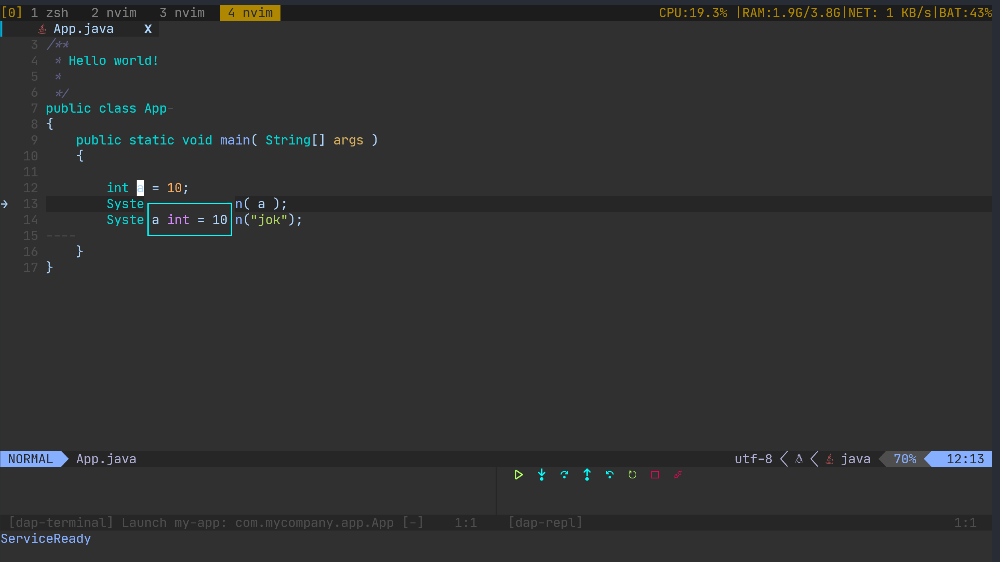
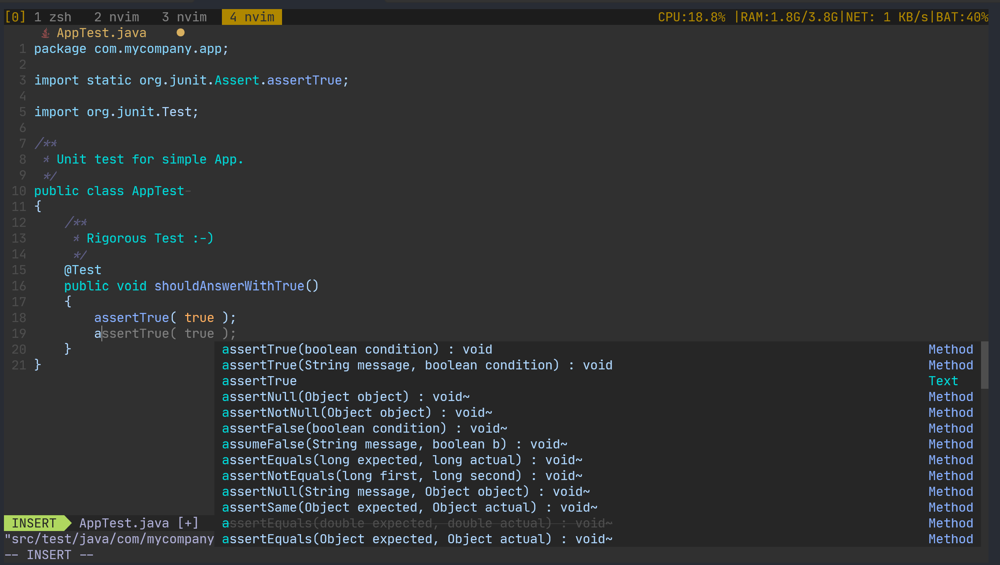
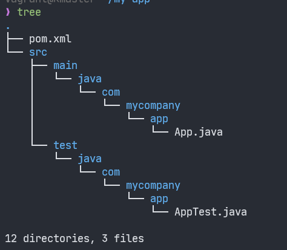

# 使用 neovim 开发 spring boot 项目
本文在debain系统中搭建java开发环境；配置neovim, 支持代码补全和代码调试；使用 maven项目和spring boot项目验证调试能力。

## 为什么开始学习java
* 1, 陈皓大佬说除了java语言，其他语言没有架构，准备体验下味道。
* 2, neovim下开发java对我来说已经够用了。支持补全，调试，速度快。
* 3, 多个语言，多个机会，开干。

## 成品界面
调试的程序为 maven 标准项目。spring boot也可以调试。spring boot 快速开始会单独起文章，这里只提供参考连接。

### 调试界面


### 代码补全界面


## 安装 jdk 和 maven
`sudo apt install -y openjdk-17-jdk maven`
### maven切换到阿里云镜像
[ 阿里云 maven ](https://zhuanlan.zhihu.com/p/71998219)

## 安装 [java-debug](https://github.com/microsoft/java-debug) 和 [vscode-java-test](https://github.com/microsoft/vscode-java-test)

```bash
#!/usr/bin/sh

INSTALL_FOLDER="$HOME/.local/share/nvim"

# Install java-debug
rm -rf "$INSTALL_FOLDER/java-debug"
git clone https://github.com/microsoft/java-debug.git "$INSTALL_FOLDER/java-debug"
cd "$INSTALL_FOLDER/java-debug" && ./mvnw clean install

# Install vscode-java-test
rm -rf "$INSTALL_FOLDER/vscode-java-test"
git clone https://github.com/microsoft/vscode-java-test.git "$INSTALL_FOLDER/vscode-java-test"
cd "$INSTALL_FOLDER/vscode-java-test" && npm install && npm run build-plugin

```

## 安装 jdtls
`MasonInstall jdtls`

## 安装neovim 插件
`use 'mfussenegger/nvim-jdtls'`
## 配置 nvim-jdtls
新增文件 ~/.config/nvim/ftplugin/java.lua。内容为：

```lua 
local HOME = os.getenv "HOME"
local DEBUGGER_LOCATION = HOME .. "/.local/share/nvim"


-- Debugging
local bundles = {
    vim.fn.glob(
      DEBUGGER_LOCATION .. "/java-debug/com.microsoft.java.debug.plugin/target/com.microsoft.java.debug.plugin-*.jar"
    ),
  }
vim.list_extend(bundles, vim.split(vim.fn.glob(DEBUGGER_LOCATION .. "/vscode-java-test/server/*.jar"), "\n"))
-- jdtls 通过mason安装
local config = {
    cmd = {DEBUGGER_LOCATION .. '/mason/bin/jdtls'},
    root_dir =vim.fs.dirname(vim.fs.find({'.git','mvnw','gradlew'},{upward=true})[1]),
    init_options = {
        bundles = bundles
    },
}

config.on_attach = function(client,bufnr)
    require("jdtls").setup_dap {hotcodereplace = "auto"}
    require("jdtls").setup.add_commands()
    require("jdtls.dap").setup_dap_main_class_configs()
end

require("jdtls").start_or_attach(config)
```
## nvim dap
```lua 
 lua require'dap'.toggle_breakpoint()
 lua require'dap'.continue()
 lua require'dap'.step_over()
 lua require'dap'.step_into()
 lua require'dap'.repl.open()
 lua require'jdtls'.test_nearest_method()
 lua require'jdtls'.test_class()
```
## maven project
在[五分钟maven](https://maven.apache.org/guides/getting-started/maven-in-five-minutes.html)中使用下列命令，生成maven项目。  
`mvn archetype:generate -DgroupId=com.mycompany.app -DartifactId=my-app -DarchetypeArtifactId=maven-archetype-quickstart -DarchetypeVersion=1.4 -DinteractiveMode=false`  

目录结构如图:  



## spring boot project
[spring boot quick start](https://spring.io/guides/gs/spring-boot/)

## 具体修改
[neovim 下 java IDE 搭建](https://github.com/zhoupro/devbox/commit/6e190261980644df1db886188ff0b2ade329c6df)

## 参考
* [1, neovim-for-beginners-java-debugging](https://alpha2phi.medium.com/neovim-for-beginners-java-debugging-f141dc2bca96)
* [2, setup-neovim-for-java-development](https://zignar.net/2020/10/17/setup-neovim-for-java-development-2/)


## 总结
本文有些跳跃，主要是记录搭建过程，如感兴趣，没描述清楚，欢迎沟通。

