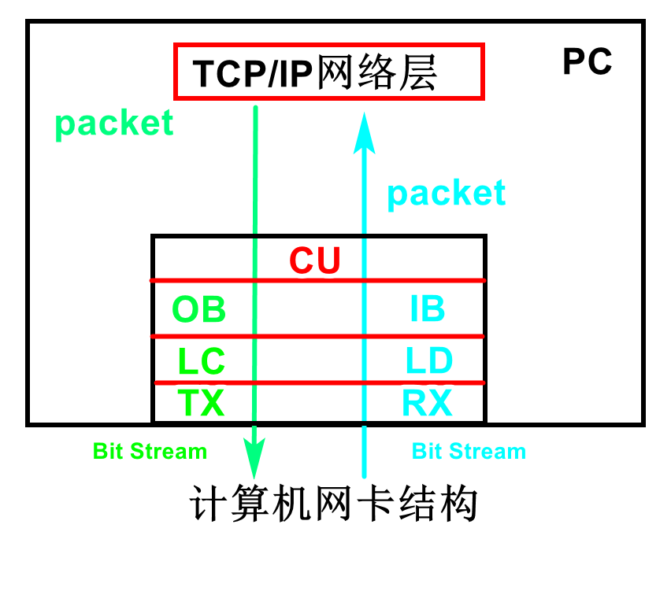
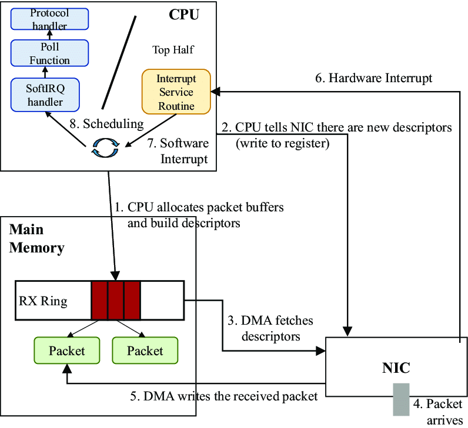
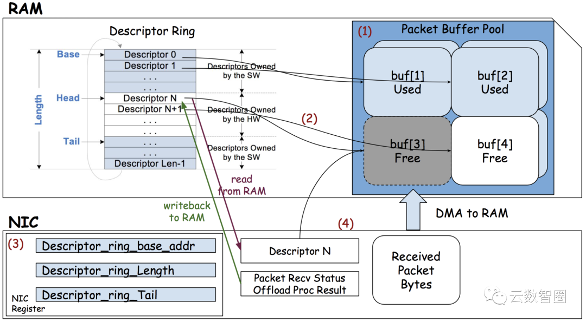

# 网卡收发数据流程入门

## 网卡原理

网卡硬件中包括输入、输出缓冲区。网卡会检测网络是否有数据，数据是否合法，是否是发给自己的数据。如果符合上述条件。就会把数据写入到网卡的硬件输入缓存区，触发中断，告诉操作系统有网络数据。操作系统使用汇编语言读取输入缓冲区数据到内存。输入输出速度较慢，读写操作可上DMA系统，加快整体速度。网卡有自己的逻辑处理单元。比如校验是否为合法包、包是否损坏等不需要CPU的参与。

### 网卡硬件

图 1
### 信息发送
* 计算机的应用软件会产生等待发送的原始数据，这些数据经过TCP/IP模型的应用层、传输层、网络层处理后，得到一个一个的数据包（Packet）。然后，网络层会将这些数据包逐个下传给网卡的CU。

* CU 从网络层哪里接收到数据包之后，会将每个数据包封装成帧（Frame）。在以太网中封装的数据帧为以太帧（Ethernet Frame）。然后CU单元会将这些帧逐个传递给OB。

* OB从CU哪里接收到帧以后，会按帧的接收顺序将这些帧排成一个队列，然后将队列中的帧逐个传递给LC。先从CU哪里接收的帧会先传给LC。

* LC从OB哪里接收到帧之后，会对这些帧进行线路编码。从逻辑上讲，一个帧就是一个长度有限的一串“0”和“1”。OB中的“0”和“1”所对应的物理量（指电平、电流、电荷等）只适合于待在缓存之中，而不适合于在线路上进行传输。LC的作用就是将这些“0”和“1”所对应的物理量转换成适合于在线路上进行传输的物理信号，并将物理信号传递给TX。

* TX从LC哪里接收到物理信号之后，会对物理信号的功率等特性进行调整，然后将调整后的物理信号通过线路发送出去。

### 信息接收
* RX从传输介质（例如双绞线）哪里接收到物理信号（指电压/电流波形等），然后对物理信号的功率特性进行调整，再将调整后的物理信号传递给LD。

*  LD会对来自RX的物理信号进行线路解码。线路解码：就是从物理信号中识别出逻辑上的“0”和“1”，并将这些“0”和“1”重新表达为适合于待在缓存中的物理量（指电平、电流、电荷等），然后将这些“0”和“1”以帧为单位逐渐传递给IB。

* IB从LD哪里接收到帧以后，会按照帧的接收顺序将这些帧逐渐排列成一个队列，然后将队列中的帧逐个传递给CU，先从LD哪里接收的帧会先传给CU。

* CU从IB哪里接收到帧以后，会对帧进行分析和处理，一个帧的处理结果有且只有两种可能：直接将这个帧丢弃，或者将这个帧的帧头和帧尾丢弃，得到数据包，然后将数据包上传给TCP/IP模型的网络层。

* 从CU上传到网络层的数据包会经过网络层、传输层、应用层逐层处理，处理后的数据被送达给应用软件使用。当然，数据也可能会在某一层的处理中提前丢失了，从而无法到达给应用软件。

## Linux 下网卡接收数据包过程

图 2

* 1，操作系统分配 Rx ring, 以及 Rx ring指向的内存缓冲区。
* 2，操作系统通知网卡有可用的Rx ring。
* 3，网卡DMA拉取Rx ring，设置寄存器。
* 4，网络数据到达网卡缓存区。
* 5，网卡DMA将数据从网卡缓冲区写入内存的Rx ring指向的内存缓冲区。
* 6，网卡触发硬键中断
* 7，操作系统设置软中断
* 8，计划任务调用软中断回调函数，回调函数查询Rx ring数据，调用相关协议处理函数。

图 3
在图3 中，可以看到网卡中有寄存器以及缓存区。有些寄存器保存了Rx ring的头、尾、单个结构体的长度。DMA系统会消费这些信息。

## 参考
* [1, 网卡硬件组成 ](https://www.cnblogs.com/winter-blogs/p/12003210.html)
* [2, 数据包到网卡在通过DMA到内存过程 ](https://cloud.tencent.com/developer/article/2241947)

## 总结
网卡涉及硬件与软件的交互，资料较少，本文整理与网络，建立基本的网卡概念，为后续分析网络协议打下基础。本文后续随认知会不断迭代。
