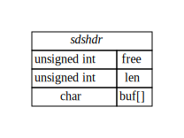
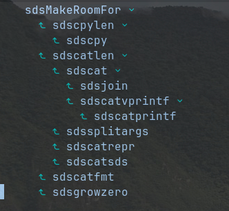

# Redis 之 SDS
C 语言的字符串以字节数组存储，以'\0'结尾。有两个限制，一：数组中间不能存储'\0'字符，二：获取字符串长度需遍历整个数组 。  
SDS 是 Redis 中的字符串类型的一种实现，克服原生字符串的限制，可以存储二进制数据，获取字符串长度的复杂度为 O(1)。

## 1 数据结构
SDS 数据结构比较简单，包含三个属性，free、len 和 buf 字符数组。len 保存的是字符串的长度，free是剩余可用长度。具体细节在介绍算法时描述。  


## 2 算法
### 2-1 SDS 字符串
`free` 和 `len` 相等。值等于存储字符的长度。
 `mystring = sdsnewlen("abc",3)` 中字符长度为3。buf数组存储数据为"abc"

```c
sds sdsnewlen(const void *init, size_t initlen) {
    struct sdshdr *sh;
    if (init) {
        sh = zmalloc(sizeof(struct sdshdr)+initlen+1);
    } else {
        sh = zcalloc(sizeof(struct sdshdr)+initlen+1);
    }
    if (sh == NULL) return NULL;
    sh->len = initlen;
    sh->free = 0;
    if (initlen && init)
        memcpy(sh->buf, init, initlen);
    sh->buf[initlen] = '\0';
    return (char*)sh->buf;
}

```
代码：创建 SDS

### 2-2 字符串扩容
通过图x-1可知，在`sdscpy` 和 `sdscat` 前，需要保证目标字符串的有足够的空间。
  
 图x-1 字符串扩容

 `addlen`是需要本次新增的长度。比如在`sdscpy`中，如果可用空间小于被拷贝字符串长度。`addlen`为被拷贝字符长度和原字符串长度差。在`sdscat`中，`addlen` 为 被拷贝字符串长度。

 如果可用空间大于本次需要的程度，无须扩容。

 目标长度为`len+addlen`。如果目标长度小于1M, `buf` 数组长度为目标长度的两倍，即`newlen=(len+addlen)*2` 。  
 如果目标长度大于1M, 数组长度新增1M,即 `newlen+=1024*1024`。

```c
sds sdsMakeRoomFor(sds s, size_t addlen) {
    struct sdshdr *sh, *newsh;
    size_t free = sdsavail(s);
    size_t len, newlen;
    if (free >= addlen) return s;
    len = sdslen(s);
    sh = (void*) (s-(sizeof(struct sdshdr)));
    newlen = (len+addlen);
    if (newlen < SDS_MAX_PREALLOC)
        newlen *= 2;
    else
        newlen += SDS_MAX_PREALLOC;
    newsh = zrealloc(sh, sizeof(struct sdshdr)+newlen+1);
    if (newsh == NULL) return NULL;
    newsh->free = newlen - len;
    return newsh->buf;
}

```
代码：SDS 扩容


### 2-3 SDS 复用
aof_buf 是一个 SDS, 被用作了缓存区。如果已分配的空间小于4K,直接复用原结构体。否则释放空间，新键一个空 SDS。

```c
if ((sdslen(server.aof_buf)+sdsavail(server.aof_buf)) < 4000) {
    sdsclear(server.aof_buf);
} else {
    sdsfree(server.aof_buf);
    server.aof_buf = sdsempty();
}

```
代码：aof_buf的复用

```c
void sdsclear(sds s) {
    struct sdshdr *sh = (void*) (s-(sizeof(struct sdshdr)));
    sh->free += sh->len;
    sh->len = 0;
    sh->buf[0] = '\0';
}
```  
代码：清空SDS

## 总结
本文分析 SDS 的实现。正常声明字符串时，`free` 和 `len` 相等，即无空间浪费。  
在执行`sdscpy`等操作时，SDS 会动态扩容。  
在比如缓冲区场景下，分配空间不大于4K, 是，复用 SDS结构。  
避免了频繁的内存分配，提升了性能。
